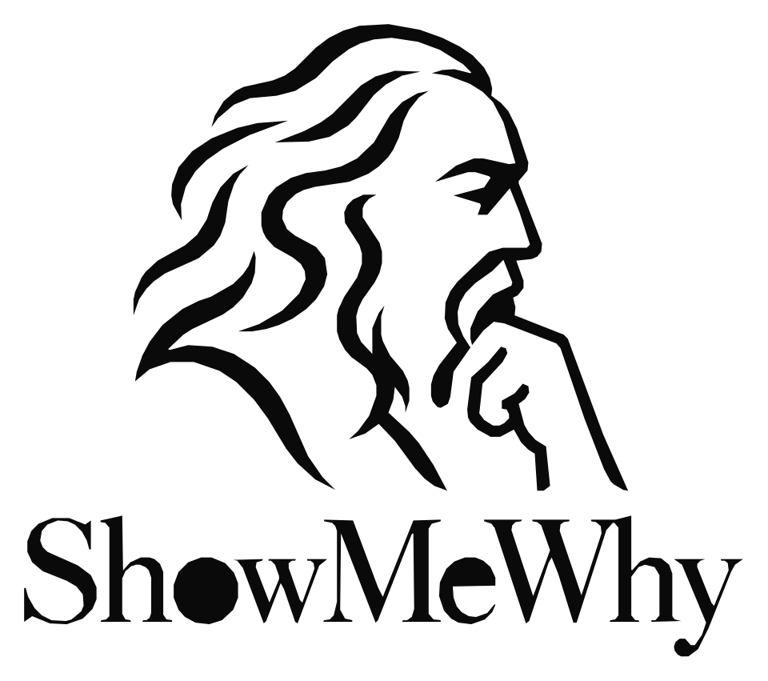

**Review only what the AI couldn't prove.**

Turn agent output into the smallest remaining verification surface.

**Most tools show you more. ShowMeWhy removes what you no longer need to review.**

  

## Install

Claude Code:

~~~text
/plugin marketplace add vishnu-77/showmewhy
/plugin install showmewhy@showmewhy
/reload-plugins
~~~

Shell equivalent:

~~~bash
claude plugin marketplace add vishnu-77/showmewhy
claude plugin install showmewhy@showmewhy
~~~

Then:

~~~text
/showmewhy
~~~

Or ask directly:

~~~text
/showmewhy is this migration actually safe to ship?
~~~

macOS / Linux / WSL:

~~~bash
curl -fsSL https://raw.githubusercontent.com/vishnu-77/showmewhy/main/install.sh | bash
~~~

Windows PowerShell:

~~~powershell
irm https://raw.githubusercontent.com/vishnu-77/showmewhy/main/install.ps1 | iex
~~~

## What it does

Agents tell you what they changed. ShowMeWhy checks which parts of that story are actually established.

It breaks a result into material claims, looks for observable evidence, closes what it can, and shows only what still needs human verification.

### Example

~~~text
Agent:

State light restored.

READY                  neutral
RISK                   red
CONNECT / SCANNING     amber
VERIFY                 amber
DONE                   green

Decorative dots removed.
Header and footer stay clean.
~~~

That sounds complete. It is still several claims.

Run `/showmewhy`:

~~~text
SHOWMEWHY

The status-light change is mostly verified.

5 verified · 1 need you

NEEDS YOU
1  DONE renders green in the actual UI · MEDIUM
   The mapping exists in code, but DONE was not exercised
   in the rendered component.

DO NEXT
Trigger DONE and inspect the rendered status indicator.
~~~

If the implementation removed the semantic light with the decorative dots:

~~~text
SHOWMEWHY

The requested status indicator was not fully restored.

4 verified · 1 refuted

REFUTED
1  Exactly one semantic status light remains · HIGH
   The decorative dots were removed, but the semantic
   indicator was removed with them.

DO NEXT
Restore the status indicator without reintroducing
the decorative dot matrix.
~~~

**The point:** do not review everything. Review only what the evidence could not settle.

## The rules

1. **Agent assertions are not evidence.** “Done” and “tests pass” do not close a claim by themselves.
2. **Verify claims, not file counts.** Small changes can carry large consequences.
3. **Every material claim gets an obligation.** What would establish or refute it?
4. **Prefer witnesses over prose.** Tests, sources, measurements, invariants, boundaries and counterexamples.
5. **Broad claims get attacked.** “Safe”, “all”, “backwards compatible”, “no regression” and similar claims need stronger evidence.
6. **Only three states:** `VERIFIED`, `REFUTED`, `OPEN`.
7. **Show the remaining work.** Default output is the smallest unresolved verification surface.

Full contract: [`skills/showmewhy/SKILL.md`](skills/showmewhy/SKILL.md).

## How it works

~~~text
CLAIM
  ↓
OBLIGATION
  ↓
WITNESS
  ↓
SCRUTINY
  ↓
VERIFIED · REFUTED · OPEN
  ↓
SURFACE
~~~

The human-facing output stays small:

~~~text
RESULT      narrowest defensible conclusion
NEEDS YOU   unresolved or refuted material claims
DO NEXT     one action that closes the highest-value gap
~~~

Private chain-of-thought is never exposed or reconstructed.

## When the answer changes

New evidence can invalidate an earlier conclusion. ShowMeWhy surfaces the delta instead of replaying the whole investigation.

~~~text
SHOWMEWHY · DELTA

CHANGED
PI-901 cannot safely proceed until PI-906 updates the chart pin.

BROKEN ASSUMPTION
The consumed shared-chart version already contains the required fix.

NEW EVIDENCE
v1.5.0 is pinned; the fix lands in v1.6.1.

DO NEXT
Update the chart pin, then rerun the planned checks.
~~~

Reference implementation: [`context_delta.py`](skills/showmewhy/scripts/context_delta.py).

## Commands

| Command | Use |
|---|---|
| `/showmewhy` | smallest unresolved surface |
| `/showmewhy short` | one gap + one next action |
| `/showmewhy why` | expanded claim/witness ledger |
| `/showmewhy compare` | evidence-aware comparison |
| `/showmewhy deep` | broader verification |
| `/showmewhy json` | machine-readable output |
| `/showmewhy status` | installation/update state |
| `/showmewhy update` | update the plugin |

Composition stays inside one command:

~~~text
/showmewhy /monitor /showmewhy /focus -- investigate why auth tests fail
~~~

## Beyond code

The contract is domain-general. Only the witnesses change.

| Domain | Claim | Useful witness |
|---|---|---|
| Code | migration is backwards compatible | old-client regression |
| Security | production identities require MFA | policy + exception search |
| Research | method reduces energy use | direct measurement |
| Data | migration preserves semantics | invariant + downstream fixture |
| Architecture | single point of failure removed | dependency/failure probe |

## Under the hood

- **Local evidence:** verbose tool results can be retained as raw evidence and referenced later.
- **Safe compression:** incomplete digests never silently replace the original visible tool output.
- **Provenance:** retained evidence and runs can receive stable `evidence://...` and `run://...` addresses.
- **Inspectable contracts:** deterministic verifier, schemas and evaluation code are in the repository.

Runtime state lives **outside the consumer repository**.

Runtime details: [`runtime/README.md`](runtime/README.md).

## Evaluation

ShowMeWhy does not treat a nice-looking demo as proof of effectiveness.

The V5 evaluation asks:

> **Can ShowMeWhy reduce the evidence a human must inspect while preserving detection of consequential agent errors?**

The repository includes the scorer, schema, frozen real-world pilot corpus and executable upstream oracle validation.

Primary measurements:

- material-failure recall
- verification-surface reduction
- false closure
- inspection time / lines / tokens

See [`evals/v5/`](evals/v5/).

**No effectiveness number is claimed here until the paired evaluation produces one.**

Release history belongs in [`CHANGELOG.md`](CHANGELOG.md) and [GitHub Releases](https://github.com/vishnu-77/showmewhy/releases).

Run the deterministic suite:

~~~bash
python -m unittest discover -s evals -p 'test_*.py'
~~~

## License

[MIT](LICENSE).

---

**Local-first · fail-open · inspectable**

Star the repo if ShowMeWhy removed one thing you no longer had to review.

