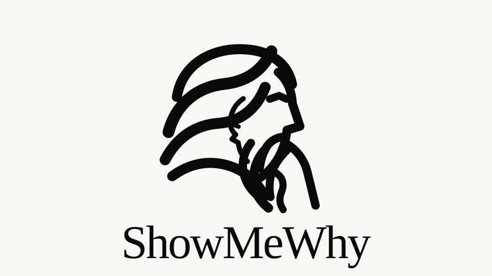

<div align="center">



**Know what the agent proved. Review only what remains.**

ShowMeWhy checks material agent claims against observable evidence and returns the smallest useful review surface: what is settled, what is still open, and what to do next.

<p>
  <a href="LICENSE"></a>
  <a href="https://github.com/vishnu-77/showmewhy/actions/workflows/test.yml"></a>
</p>

</div>

## Install

### macOS, Linux and WSL

```bash
curl -fsSL https://raw.githubusercontent.com/vishnu-77/showmewhy/main/install.sh | bash
```

### Windows PowerShell

```powershell
irm https://raw.githubusercontent.com/vishnu-77/showmewhy/main/install.ps1 | iex
```

Then use:

```text
/showmewhy:showmewhy
```

or give it a fresh question:

```text
/showmewhy:showmewhy is this migration actually safe to ship?
```

The installer sets up one marketplace-managed plugin containing the Skill, hooks and runtime, enables ShowMeWhy marketplace auto-update, and removes the older copied personal Skill if one exists.

## What it does

AI makes work cheap to produce; trust is still expensive. ShowMeWhy is a verification layer for agent output, not another summary generator.

It turns important claims into explicit verification obligations, looks for direct witnesses or counterexamples, closes what the available evidence can actually establish, and surfaces only the material gaps that still need attention.

```text
Agent: Done. Authentication migration complete. All tests pass.

/showmewhy:showmewhy

SHOWMEWHY

Authentication migration works for the tested paths,
but legacy-token compatibility is still unverified.

2 verified · 1 need you

NEEDS YOU
1  Pre-migration mobile tokens remain compatible · HIGH
   No pre-migration mobile token was exercised.

DO NEXT
Run a pre-migration mobile token through the new verifier.
```

**Most review tools add more output. ShowMeWhy removes what no longer requires your attention.**

## Before / after

<table>
<tr>
<td width="50%" valign="top">

### Before

> The agent changed 47 files and says the migration is complete. Tests are green, the new token path works, and the middleware has been updated. You still need to inspect the diff, work out which claims matter, decide whether the tests actually prove them, look for compatibility issues, and figure out what to check next.

</td>
<td width="50%" valign="top">

### After

```text
SHOWMEWHY

Migration works for tested paths.

18 verified · 2 need you

NEEDS YOU
1  Rollback behaviour · HIGH
   Rollback was never executed.

2  Legacy-client compatibility
   No old-client fixture was exercised.

DO NEXT
Run migrate → write → rollback → read.
```

</td>
</tr>
</table>

## When the answer changes

Agents often discover the decisive fact **after** a plan or conclusion has already been formed. ShowMeWhy detects that state change automatically rather than explaining the whole session again.

```text
Earlier
PI-901 can proceed after the planned NetworkPolicy work.

Later evidence
hl2-saas-helm pins shared charts v1.5.0.
PI-823 is fixed only in v1.6.1.

/showmewhy:showmewhy

SHOWMEWHY · DELTA

CHANGED
PI-901 cannot safely proceed until PI-906 updates the chart pin.

BROKEN ASSUMPTION
The consumed shared-chart version is safe for NetworkPolicy enforcement.

NEW EVIDENCE
v1.5.0 is pinned; the required PI-823 fix lands in v1.6.1.

BLOCKER
PI-906 · bump the shared-chart pin.

DO NEXT
Merge PI-906, then run the planned maintenance-window smoke tests.
```

The core verifier is unchanged. Context Delta simply compares the earlier and current verification states and exposes **what changed, what assumption broke, and what now matters**.

## The output

Default ShowMeWhy output has three jobs:

```text
RESULT      the narrowest defensible conclusion
NEEDS YOU   only material claims still open or refuted
DO NEXT     one action that closes the highest-value gap
```

When new evidence materially changes an earlier result, the same command switches to:

```text
CHANGED             the current defensible conclusion
BROKEN ASSUMPTION   the relied-upon premise invalidated by evidence
DO NEXT             one action that resolves the changed obligation
```

No proof DAG. No mandatory MONITOR block. No carbon footer. No catalogue of every passing check. No retrospective story about how the agent eventually noticed the issue.

If everything material can be independently settled:

```text
SHOWMEWHY

The measured claim is supported.

VERIFIED
6 material claims independently settled.

DO NEXT
No material verification gap found.
```

Use `why` mode when you actually want the expanded claim/witness ledger.

## The rules

1. **Agent assertions are not evidence.** “Done”, “tests pass”, and confidence language never close a claim by themselves.
2. **Verify claims, not line counts.** A 10-line security change can matter more than 10,000 generated lines.
3. **Every material claim gets an obligation.** What would establish it? What would refute it?
4. **Prefer witnesses over prose.** Executions, sources, measurements, invariants, boundaries, regressions and counterexamples beat another explanation.
5. **Broad claims get attacked.** “All”, “safe”, “backwards compatible”, “no regression”, and “production-ready” should trigger counterexample or boundary checks.
6. **Only three claim states exist.** `VERIFIED`, `REFUTED`, `OPEN`.
7. **New evidence can reopen old conclusions.** A prior `VERIFIED` result is not permanent if a current witness invalidates a relied-upon assumption.
8. **Default output shows the remaining work.** At most three unresolved items, then one concrete `DO NEXT`.

The full contract lives in [`skills/showmewhy/SKILL.md`](skills/showmewhy/SKILL.md).

## Works beyond code

The verification primitive is domain-general. The witnesses change; the contract does not.

| Domain | Material claim | Example witness | Typical unresolved or changed state |
|---|---|---|---|
| Code | “migration is backwards compatible” | old-client regression fixture | legacy client never exercised |
| Policy | “all production identities require MFA” | clause + exception search | legacy bypass refutes the universal claim |
| Research | “method reduces energy use” | direct measurement | only token proxy measured |
| Contract | “all notice periods are 14 days” | clause search across schedules | Schedule B still says 30 days |
| Data | “migration preserves semantics” | invariant + downstream fixture | null behaviour untested |
| Architecture | “single point of failure removed” | dependency/failure probe | shared Redis still exists |

Deterministic reference cases live in [`evals/reference_cases/`](evals/reference_cases/) and temporal Context Delta cases live in [`evals/context_delta_cases.json`](evals/context_delta_cases.json).

## Why this is different

Most review systems **add findings**. ShowMeWhy's target is the opposite: **shrink the human verification surface**.

A semantic diff can reorganise a large change. A receipt can prove that an action happened. ShowMeWhy asks a different question:

> **What material part of this result is still not independently established — and did new evidence invalidate what we believed before?**

That means a 500-line or 15,000-line change should not become a 100-line summary. If 497 of 500 material claims can be independently settled, the default surface should contain only the remaining three. If later evidence breaks one of the 497, that claim returns to the surface.

## How it works

Internally, ShowMeWhy uses a small verification grammar:

```text
CLAIM       material statement that affects trust or action
OBLIGATION  what would establish or refute it
WITNESS     observable execution, source, measurement or counterexample
SCRUTINY    does the witness really address the claim?
CLOSURE     VERIFIED · REFUTED · OPEN
SURFACE     only unresolved material claims reach the default output
```

For temporal changes, it adds four internal objects without changing the core verifier:

```text
CONTEXT SET  what was actually inspected
ASSUMPTION   what had to remain true
INVALIDATOR  new evidence that breaks the assumption
DELTA        the material state change
```

The human does not need to see that machinery unless they ask for `why` or `json` mode.

## Views

```text
/showmewhy:showmewhy             unresolved surface or automatic Context Delta
/showmewhy:showmewhy short       one gap + one next action
/showmewhy:showmewhy why         claim · state · witness/gap ledger
/showmewhy:showmewhy compare     compact comparison
/showmewhy:showmewhy monitor     session-level verification state
/showmewhy:showmewhy impact      context/token/operational impact
/showmewhy:showmewhy json        machine-readable verification or delta surface
/showmewhy:showmewhy deep        broader verification, same compact final surface
```

## Battle-tested reference behaviour

The deterministic reference engines are intentionally small enough to inspect:

```bash
python skills/showmewhy/scripts/verification_surface.py \
  evals/reference_cases/code-auth.json
```

Current fixtures cover code, policy, research, contracts, data and architecture. Context Delta fixtures additionally cover a cross-repository infrastructure blocker, a research proxy claim, a policy exception, and a contract schedule conflict.

The scale regression creates **500 material claims**, verifies 497, leaves 3 open, and asserts that the default human output does not replay the 497 settled claims.

Run the complete suite:

```bash
python -m unittest discover -s evals -p 'test_*.py'
```

## Under the hood

<details>
<summary><strong>Witness closure</strong></summary>

The deterministic verification implementation lives at [`skills/showmewhy/scripts/verification_surface.py`](skills/showmewhy/scripts/verification_surface.py). A material claim is `VERIFIED` only when its required witness kinds are present and no current witness refutes it. A refuting witness wins over supporting evidence. Missing, inconclusive, conflicting, stale or human-only evidence leaves the claim `OPEN`.

The machine contract is [`skills/showmewhy/references/verification-surface.schema.json`](skills/showmewhy/references/verification-surface.schema.json).

</details>

<details>
<summary><strong>Context Delta</strong></summary>

[`skills/showmewhy/scripts/context_delta.py`](skills/showmewhy/scripts/context_delta.py) compares previous and current verification states, detects material claim transitions, records invalidated assumptions, identifies newly inspected context, and renders only the decision-relevant change.

Its machine contract is [`skills/showmewhy/references/context-delta.schema.json`](skills/showmewhy/references/context-delta.schema.json).

</details>

<details>
<summary><strong>Context compression and retained evidence</strong></summary>

ShowMeWhy stores eligible verbose Bash results as local raw evidence before deterministic parsing. By default the hook runs in **shadow mode**: it observes a copy and leaves the tool result delivered to the agent untouched.

Output replacement is explicit opt-in with `SHOWMEWHY_MODE=replace`, and even then only complete, high-confidence structured parsers are allowed to replace the visible result. Generic, incomplete or low-confidence digests remain observational only. Reported material loss forces the adaptive policy back into shadow mode until explicitly reviewed and cleared.

Runtime state is local under `.showmewhy/`.

</details>

<details>
<summary><strong>Provenance</strong></summary>

Retained evidence and runs still receive stable local addresses such as `evidence://...` and `run://...`. Typed provenance remains available for machines and deep inspection, but it is no longer the default human UI.

Private chain-of-thought is never exposed or reconstructed.

</details>

<details>
<summary><strong>Impact accounting</strong></summary>

ShowMeWhy separates presentation reduction from context actually avoided. Shortening already-generated text does not undo inference cost. Operational CO₂e estimates are available only through explicit `impact` use when the baseline is defensible.

See [`skills/showmewhy/references/impact-methodology.md`](skills/showmewhy/references/impact-methodology.md).

</details>

## The mark

The Socratic thinker represents scrutiny before acceptance. Its flowing hair contains a quiet `S`; the smaller inner profile represents dialogue, challenge and the question behind ShowMeWhy: **how do you know?**

Brand construction and usage live in [`brand/`](brand/README.md).

## Proof

ShowMeWhy's own release path uses real acceptance gates:

| Claim | CI gate |
|---|---|
| Core contracts still work | Python 3.11, 3.12 and 3.13 |
| Claude accepts the plugin | real `claude plugin validate` |
| Marketplace install actually loads | add → install → fresh-process `plugin list` |
| Skill and runtime ship together | installed cache contains both |
| Auto-update is configured | marketplace state has `autoUpdate: true` |
| Installation is repeatable | installer runs twice on clean runners |
| Desktop install paths work | Ubuntu, macOS and Windows acceptance |

Release history belongs in [`CHANGELOG.md`](CHANGELOG.md) and [GitHub Releases](https://github.com/vishnu-77/showmewhy/releases), not in this README.

## License

[MIT](LICENSE).

---

<div align="center">

**Local-first · fail-open · inspectable**

Star the repo if ShowMeWhy removed one thing you no longer had to review.

</div>
